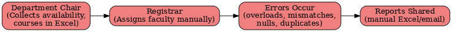

# Faculty Workload Scheduling – BA + ETL + BI Project

## 📌 Overview
This project simulates a **university faculty workload scheduling system** to demonstrate both **Business Analyst skills** (requirements, process mapping, UAT) and **technical skills** (ETL, SQL, Python, Power BI).

The project mirrors real-world initiatives such as **ERP configuration, compliance validation, and workload dashboards**.

---

## 📂 Deliverables (in progress)
- **Business Requirements Document (BRD)** → [`/docs/brd/`](docs/business_requirements_document/Faculty_Workload_BRD_v0.1.md)
- **Process Maps (Current vs Future state)** → [`/docs/process_maps/`](./docs/process_maps/)
- **Entity Relationship Diagram (ERD)** → *(coming soon)*
- **ETL Validation Rules** (SQL + Python) → *(coming soon)*
- **Power BI Dashboards** → *(coming soon)*
- **UAT Test Cases** → *(coming soon)*

---

## 🛠 Tech Stack
- **SQL Server / PostgreSQL** → ETL & validation queries  
- **Python (pandas, matplotlib)** → data validation, conflict detection  
- **Power BI** → dashboards & reporting  
- **Visio / draw.io** → process maps, ERD  

---

## 📊 Visuals (samples)

### Current vs Future Process Maps
| Current State |
|---------------|
|  |

| Future State |
|---------------|
|  |

## Issue Log
| Screenshot |
|------------|
|  |

*(Dashboards and ERD screenshots will be added here as they are developed.)*

---

## ✅ Next Steps
- [x] Draft BRD  
- [x] Create Process Maps  
- [x] Inspect dataset & design ERD  
- [ ] Write SQL/Python ETL validations  
- [ ] Build Power BI dashboards  
- [ ] Create UAT test cases  

---

## 👤 Author
**Harsh Dalwadi**  
Aspiring Data Analyst | SQL • Python • Power BI • ETL • Business Analysis  

📧 harshdalwadi.analyst@gmail.com  
🔗 [LinkedIn](https://www.linkedin.com/in/harshhd)  
