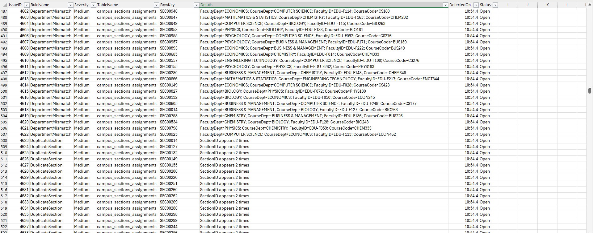

# Faculty Workload Scheduling – BA + ETL + BI Project

## 📌 Overview
This project simulates a **university faculty workload scheduling system** to demonstrate both **Business Analyst skills** (requirements, process mapping, UAT) and **technical skills** (ETL, SQL, Python, Power BI).

The project mirrors real-world initiatives such as **ERP configuration, compliance validation, and workload dashboards**.

---

## 📂 Deliverables
- **Business Requirements Document (BRD)** → [`/docs/brd/`](docs/business_requirements_document/Faculty_Workload_BRD_v0.1.md)
- **Process Maps (Current vs Future state)** → [`/docs/process_maps/`](./docs/process_maps/)
- **Entity Relationship Diagram (ERD)** → [`/docs/erd/`](./docs/erd/)
- **ETL Validation Rules** (SQL + Python) → [`/data/sql/`](./data/sql/)
- **Power BI Dashboard** → [`/reports/`](./reports/Dashboard.pbix)
- **UAT Test Cases** → [`/reports/`](./reports/issue_log_export.csv)

---

## 🛠 Tech Stack
- **SQL Server / PostgreSQL** → ETL & validation queries  
- **Python (pandas, matplotlib)** → data validation, conflict detection  
- **Power BI** → dashboards & reporting  
- **Visio / draw.io** → process maps, ERD  

---

## 📊 Visuals (samples)

### Current vs Future Process Maps
| Current State |
|---------------|
|  |

| Future State |
|---------------|
|  |

## Entity Relationship Diagram
| Diagram |
|---------|
|  |

## Issue Log
| Screenshot |
|------------|
|  |

## 📊 Dashboards

This project delivers a series of Power BI dashboards built on top of validated and curated data. Each page provides a different perspective on faculty workload scheduling.

### 1. Overview Dashboard
Gives a high-level summary of teaching workload across all terms. Highlights total sections, scheduled hours, faculty, and courses. Also shows workload distribution by department, term, and delivery mode, along with top faculty by load.

### 2. Faculty Profile
Drill-down into an individual faculty member’s workload. Displays their assignments, total hours vs. maximum load, department, employment type, and whether they are overloaded.

### 3. Course Profile
Course-centric view showing course details (code, department, credits, contact hours) and workload distribution across sections, delivery modes, terms, and assigned faculty.

## 📝 Validation & Exceptions Evidence
All data quality checks (FR-01 to FR-05) are logged in the `issue_log` table.  

It contains:
- RuleName (Overload, Unassigned, DepartmentMismatch, DuplicateSection, BadHours)
- Severity (High/Medium)
- TableName and RowKey (to locate the issue)
- Details (what was wrong)
- Status (Open/Closed)

---

## 🔚 Final Outcomes & Summary

This project successfully delivered a full faculty workload scheduling system built end-to-end. The key outcomes:

- **Validated and cleansed data pipeline**: All raw data was processed via SQL validations (FR-01 to FR-05). Any invalid rows are logged in `issue_log` and excluded from curated tables.  
- **Interactive dashboards for decision support**: The Power BI report includes:  
  1. **Overview Dashboard** : At-a-glance totals, workload distributions, and exception KPIs.  
  2. **Faculty Profile** : Drill-down for each faculty, showing assignments, total hours vs max load, availability, and overload status.  
  3. **Course Profile** : Course-level load distribution across terms, delivery modes, and assigned instructors.  
  4. **Exceptions / Issue Log** : Complete visibility into data problems with filters and evidence export.  
- **Traceability & auditability** : The project includes an exported `issue_log_export.xlsx` as proof of detected issues, and a mini testing mapping showing each functional requirement was verified.  
- **Business value & insight**:
  - Quickly identifies overloaded faculty to prevent burnout.  
  - Highlights department mismatches, unassigned sections, and bad-hours issues for cleanup.  
  - Empowers administrators to plan by term and delivery mode using data-backed dashboards.

Overall, this deliverable bridges the gap between requirements, data validation, and visual analytics — making faculty workload management transparent, auditable, and actionable.

---

## 👤 Author
**Harsh Dalwadi**  
Aspiring Data Analyst | SQL • Python • Power BI • ETL • Business Analysis  

📧 harshdalwadi.analyst@gmail.com  
🔗 [LinkedIn](https://www.linkedin.com/in/harshhd)  
